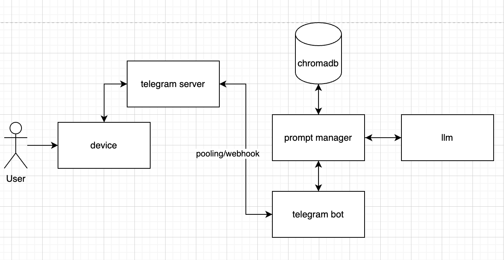

## Problem
For specific topics (e.g., legal materials), current LLMs do not have enough context and, therefore, do not answer accurately user questions.

## Project overview
A telegram bot that allows the user to add, save, and use collections of uploaded materials in order to answer user questions in specific topics.

## Install
- Install Docker
- Create .env and add the environment variables as specified in .env.example
- Run in terminal: docker compose up --build
- Access bot in telegram

## Architecture

## Tech stack
Python, FastAPI, python-telegram-bot, Chroma